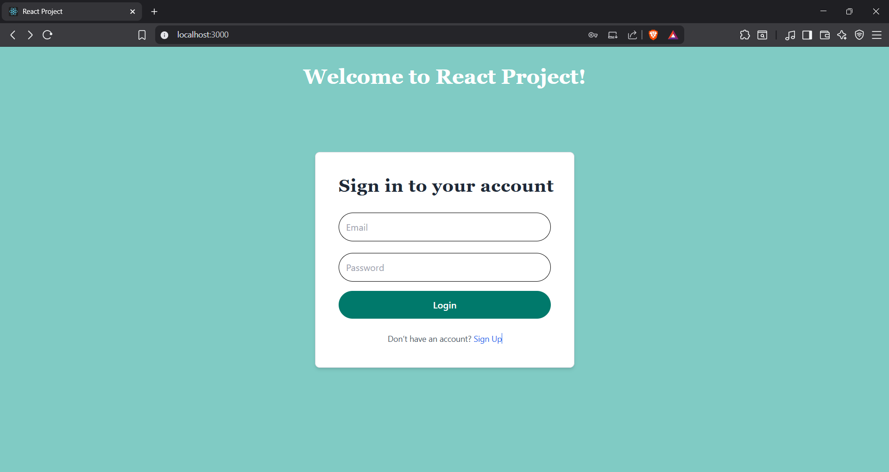

# Login & Signup App
# Project Description
  The React Login-Signup App is a modern authentication interface built using React and Firebase Authentication. It includes secure sign-up and login functionality, real-time form validation,      toast-based feedback, and clean UI styling with Tailwind CSS.
# 🛠️ Technical Details
   ✦ Language Used: JavaScript (React)

   ✦ Framework: React
  
   ✦ UI Library: Tailwind CSS
  
   ✦ Authentication: Firebase Authentication
  
   ✦ Validation: React Hook Form, Yup
  
   ✦ Notification: React Hot Toast

# ⚙️ Setup Instructions
## Frontend Setup (React)
 ✦ Built with React using functional components and hooks.
  
  ✦ Structured into pages and reusable components for clean code and separation of concerns.
  
  ✦ Used react-router-dom for client-side routing between login and signup pages.
  
  ✦ Integrated React Hook Form and Yup for form handling and validation.
  
  ✦ Installed React Hot Toast for showing success and error messages on actions.
  
  ✦ To get started:
  
  ✦On the signup page: Enter your Name, Email, Password, and Confirm Password
  
  ✦Submit the form to create your account.
  
  ✦On the login page: Enter your Email and Password to log into your account.
  
  ##  Backend Integration (Firebase + Firestore)
    
  ✦ Used Firebase Authentication for email-password based sign-up and login.

  ✦ Secure user registration with error handling (e.g., duplicate emails, weak passwords).

  ✦ Login validation with friendly Firebase error messages.

  ✦ Used Firestore Database (NoSQL) for storing additional user profile data.

  ✦ Automatically creates a Firestore document for each user after signup.

  ✦ On successful login: displays "Welcome! You have successfully logged in."
  
  ✦🛢️ Database (Firebase Firestore)
    
  ✦Integrated with Cloud Firestore to store user data.
      
  ✦On successful signup:
     
  ✦The user’s name and email are stored in Firestore securely.
      
  ## Styling (Tailwind CSS)
 ✦ Used Tailwind CSS for utility-first responsive styling.

 ✦ Styled login/signup forms with:

 ✦ Rounded input fields and buttons using rounded-full.

 ✦ Custom button hover transitions and colors.

 ✦ Responsive layout using flex utilities like flex, items-center, and justify-center.
 
 ✦ ⏳ Loading Indicators

  ✦  Animated bouncing dots (animate-bounce) are shown on form submission using a custom span loader.
   
  ## Screenshots of UI
  

  
    Login
  

   
